# AimRobot-Kookbot 使用帮助

## 阅前须知
**使用Kookbot，请确保你有一定的计算机动手能力！**
**使用Kookbot，请确保你有一定的计算机动手能力！**
**使用Kookbot，请确保你有一定的计算机动手能力！**

当前项目不会提供Jar包，你需要自行编译（Java 17）

## 部署说明

### 创建机器人
1. 前往 [Kook开发者中心](https://developer.kookapp.cn/app/index) 创建你的机器人应用，
   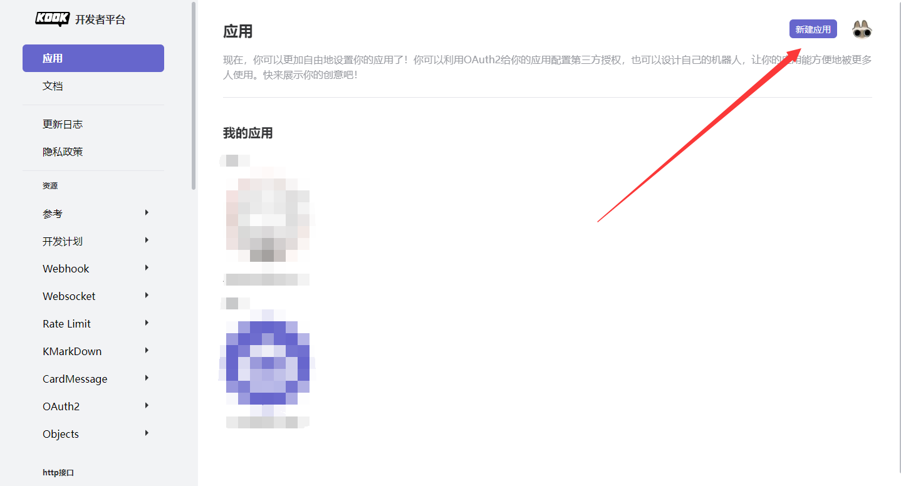
   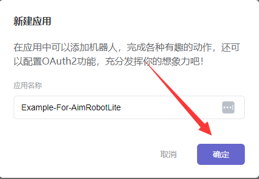
2. 记录下机器人的 `Token` 和 `ClientId`
   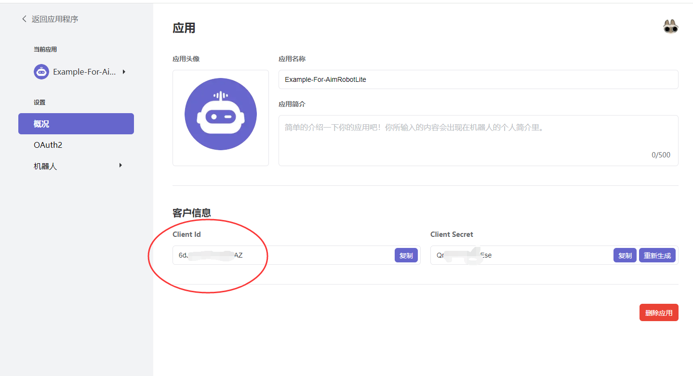
   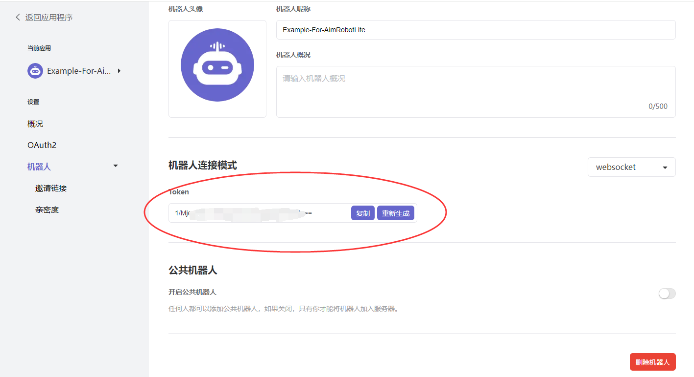
3. 设置机器人拥有的权限
   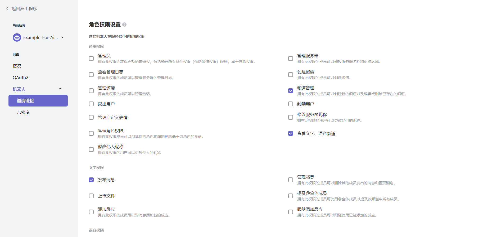
4. 邀请机器人至你的Kook
   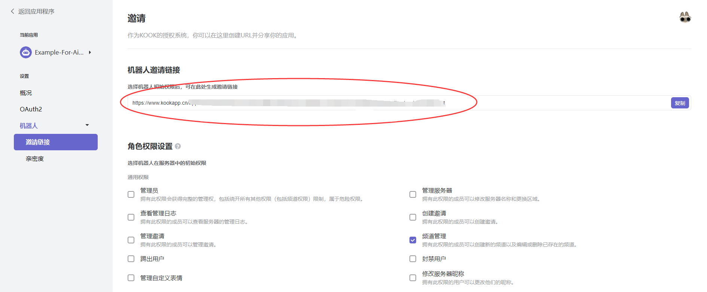
   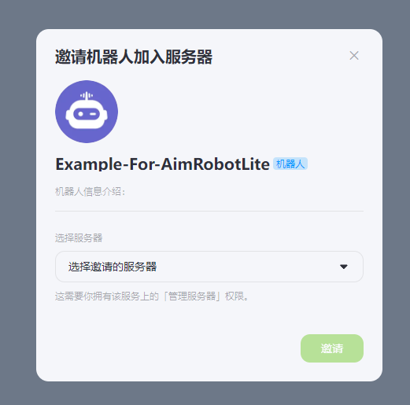

### 部署机器人程序 （以Ubuntu系统演示）
1. 将机器人程序的Jar包放入一个单独的文件夹中，并同级目录中创建三个文件
   1. **application.yml** 参考 [application.yml文件内容](src/main/resources/application.yml)
   2. **application-aimrobot.yml** 参考 [application-aimrobot.yml文件内容](src/main/resources/application-aimrobot.yml)
   3. **aimrobot.bot.json 文件**参考 [aimrobot.bot.json文件内容](src/main/resources/simbot-bots/aimrobot.bot.json), **需要将先前的 `Token` 和 `ClientId` 填写至这个文件中**
   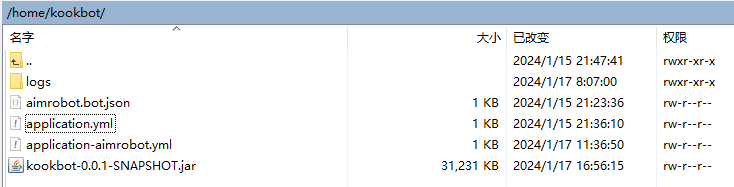

2. 启动机器人程序即可 
```shell
# 参考示范
root@example:/home/kookbot# /home/jdk-17.0.2/bin/java -jar kookbot-0.0.1-SNAPSHOT.jar
```

## 如何获取 `Kook服务器ID` 和 `Kook用户ID` ？
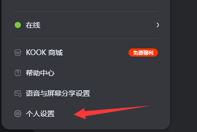
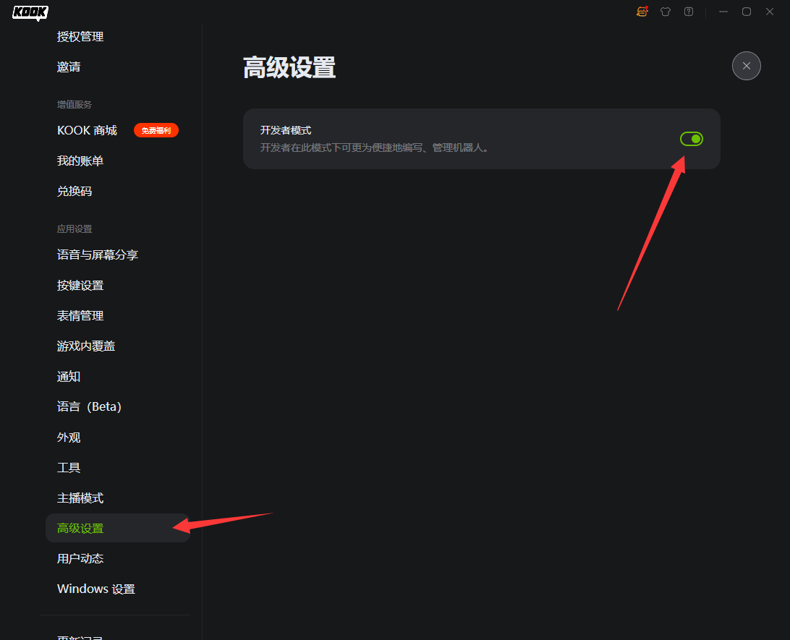
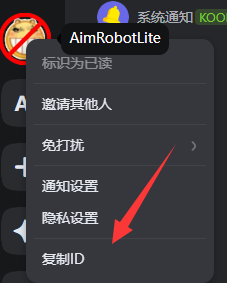
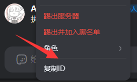
